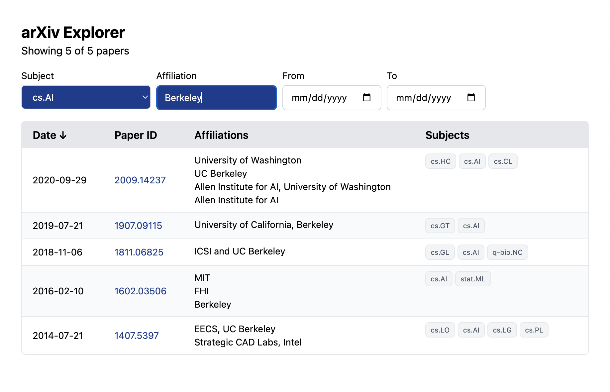

# arXiv Explorer

**Live demo:** https://arxiv-explorer.netlify.app

A filterable, sortable table for exploring arXiv research paper metadata. Built
to make it quick to slice ~169k papers by subject, affiliation, and publication
date when looking at research activity.

## What I built

The dataset is a large set of arXiv paper metadata that includes paper IDs,
author affiliations, subjects, and publication dates. I built a table based
interface for exploring it: three live filters (subject, affiliation, date
range) and a sortable date column.

I chose a table over charts on purpose. The exercise is about _interacting_ with
the metadata, and a sortable, filterable list lets a user answer concrete
questions like "what came out of this institution," "what's recent in this
subject", directly without committing to a particular visualization up front.

## Running locally

```bash
npm install
npm run dev
```

The data file (`papers.json`, ~48MB) lives in `public/data/` and is fetched at
runtime rather than bundled, since it's too big to import.

## Design choices

- **Grouping by paper ID.** The raw data has one row per paper affiliation pair,
  so the same paper appears multiple times. I group records by paper ID at fetch
  time and collapse them into one row per paper, with affiliations as a list.
  This is done once on load, not per render.

- **Affiliation filter is a substring match on the raw strings.** The
  affiliation data is free-form and messy, for example "tokyo," "The University
  of Tokyo," and "Department of Physics, Tokyo" all appear. Rather than attempt
  normalization, I treat affiliation as a case-insensitive substring search.
  This is a deliberate scope decision (see Tradeoffs).

- **Subject filter grouped by prefix.** There are more than 145 unique subjects,
  too many for a flat dropdown. I group them into `<optgroup>`s by prefix (cs._,
  astro-ph._, etc.) so the list is scannable.

- **100-row display cap.** Because of how many papers there are, rendering all
  matching rows freezes the browser. The table caps the display at 100 rows; the
  header always shows the full match count ("Showing 100 of N papers").

- **Debounced affiliation input.** Filtering the full dataset on every keystroke
  causes lag. The affiliation input is debounced 300ms so filtering runs after
  typing pauses, while the input itself stays responsive.

- **Date handling.** Dates are compared as ISO date strings (`YYYY-MM-DD`),
  because they sort and compare correctly without constructing Date objects.
  Default sort is newest-first; the Date column header toggles direction with
  the arrows.

## Tradeoffs & what I'd add

- **Data loading.** The full dataset (358k records, 48MB) is fetched on page
  load, which crushes initial load time. Lighthouse Performance score is 43 for
  this reason, while Accessibility, Best Practices, and SEO score 100/100/90. A
  production app would use pagination and data from an API or database rather
  than fetching the entire dataset to the browser. That would be the biggest
  single performance improvement.

- **Affiliation normalization.** Affiliation matching is substring-based, so
  "MIT" and "Massachusetts Institute of Technology" wouldn't match to the same
  institution. In a production version I would normalize affiliations using
  something like the Research Organization Registry, to assign canonical IDs to
  research institutions to help filter and group by institutions.

- **Pagination.** The 100 row cap is a simple way to keep rendering fast. Real
  pagination or windowed/virtualized rendering would let users navigate through
  the full set of results.

- **Component structure.** Everything is in a single `App.jsx`. Given the time
  limit, I kept it in one file. With more time I'd put the data utilities into a
  `utils` and split the UI into `FilterBar` and `PapersTable` components for
  clear separation and to make it easier to test.

- **Mobile.** The layout doesn't break on small screens. The filters stack, the
  table scrolls horizontally, but I didn't have enough time for a true mobile
  first redesign like card based rows instead of a wide table.

## AI disclosure

The exercise notes a preference for no AI tools, with disclosure if used. I used
Claude during this build, and want to be specific about how.

**What Claude did:**

- Talked through React patterns when I was deciding how to approach something
  like debouncing the affiliation input.
- Caught typos and small bugs in code I'd already written (missing `key` props,
  a misspelled state setter, an `onChange` placed on the wrong element).

**What I decided:**

- The overall concept: a filterable, sortable table of paper metadata, rather
  than a chart-based interface.
- Every design choice in the section above: grouping by paper ID, substring
  matching on affiliations instead of normalizing, grouping subjects by prefix,
  the 100 row cap, the debounce, ISO string date comparison.
- The scope calls: what to build, what to cut for time, what to leave for the
  Tradeoffs section.
- All the judgment calls captured in NOTES.md as I made them.

I drove the build and made the engineering and design decisions. Claude acted
like a pair programmer for debugging, code review, and talking through
implementation options.

## Time spent

4 hours

## See also

- `NOTES.md` at the repo root is the running log of design decisions I kept
  during the build.
- `docs/wireframe-sketch.jpeg` — initial wireframe sketch; the final UI follows
  it closely
